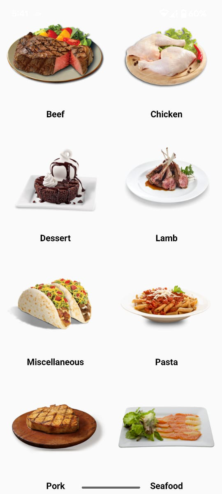
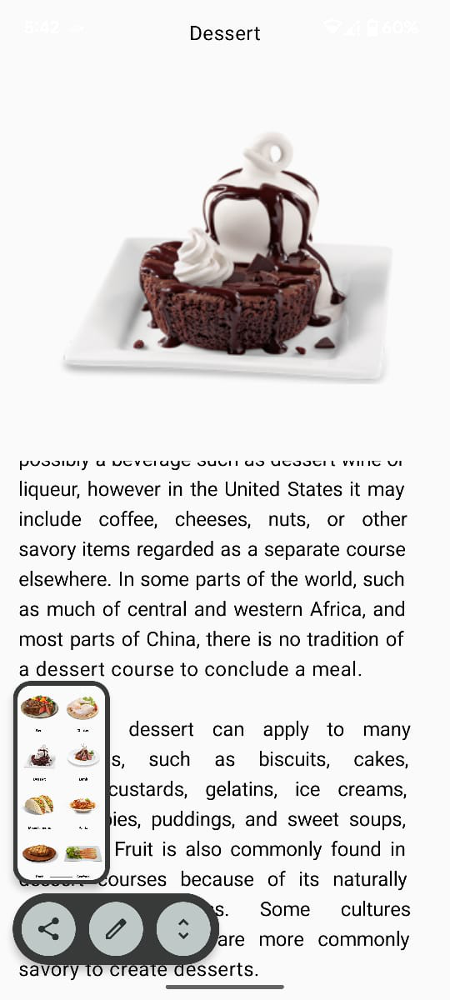

# 🍽️ MyRecipeApp

**MyRecipeApp** is a modern Android application built using **Kotlin**, **MVVM architecture**, **Retrofit**, and **Jetpack Compose**. It fetches and displays meal categories from the [MealDB API](https://www.themealdb.com/), allowing users to explore various recipes in a smooth, declarative UI experience.

---

## ✨ Features

- 🧠 **MVVM Architecture** – Clean separation of UI, data, and business logic for maintainability.
- 🔗 **Retrofit Integration** – Seamless network calls to fetch data from MealDB API.
- 🖌️ **Jetpack Compose UI** – Modern, reactive UI design using Google’s declarative toolkit.
- 🚀 **Navigation Component** – Simplified screen-to-screen navigation.
- ⚠️ **Error Handling** – Graceful error messages and loading indicators.
- 🌙 **Dark Mode Support** *(if implemented)*

---

## 🛠️ Tech Stack

| Tool | Use |
|------|-----|
| **Kotlin** | Primary development language |
| **Retrofit** | API communication |
| **Jetpack Compose** | UI Design |
| **Coroutines** | Async tasks and background operations |
| **MVVM** | Architecture pattern |
| **Git & GitHub** | Version control and project hosting |

---

## 📸 Screenshots

| Home Screen | Edit Screen |
|-------------|-------------|
|  |  |

---

## 📦 Setup Instructions

### 🔄 Clone the repository:
```bash
git clone https://github.com/mashhukhangandapur/MyRecipeApp.git
cd MyRecipeApp
